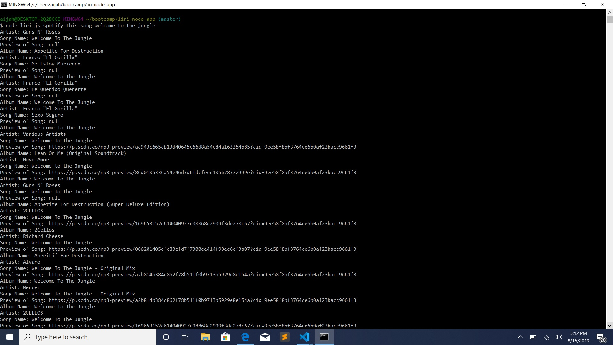
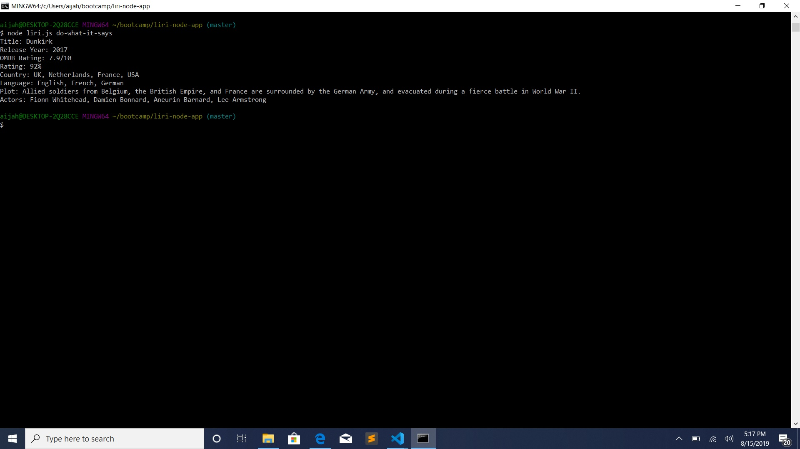
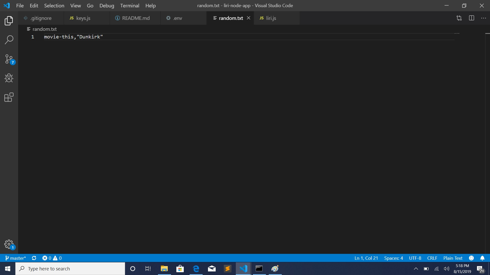

# LIRI-NODE-APP (Language Interpretation and Recognition Interface)

LIRI is a command line node app that takes in parameters and gives you back data based off the following parameters: 

-	spotify-this-song
-	movie-this
-	do-what-it-says

## Getting Started: 
Download the "screenshots" folder to access the animations of each command. 
This will allow you to better see how LIRI works with each given command. 

## Spotify-this-song: 

This will show the following information about the song in your terminal/bash window

-	Artist(s)
-	The song's name
-	A preview link of the song from Spotify
-	The album that the song is from

## movie-this: 

This will output the following information to your terminal/bash window:
-	Title of the movie.
-	Year the movie came out.
-	OMDB Rating of the movie.
-	Rotten Tomatoes Rating of the movie.
-	Country where the movie was produced.
-	Language of the movie.
-	Plot of the movie.
-	Actors in the movie.

## do-what-it-says: 

LIRI will use the text from “random.txt” and call on of LIRI’s commands. 
It should run movie-this for “Dunkirk”. 

## Technologies used:

* Spotify API
* OMDB API
* Axios package
* Node.js
* Javascript
* Moment package
* Request package
